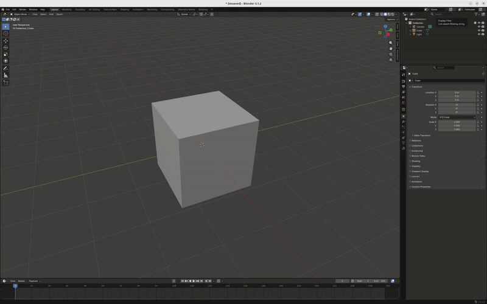

# RSDF Surface Tool

[](#)
[](https://github.com/isri-aist/rsdf_surface_exporter/releases/latest)

A Blender addon to create, visualize, and export **RSDF (Robot Surface Description Format)** surfaces from 3D models. Supports **planar and cylindrical surfaces** with full visualization in Blender.



> Warning ! Cylinder export has not been fully tested yet

---

## Features

- Add **planar surfaces** from selected mesh faces
- Add **cylindrical surfaces** from selected mesh geometry
- **Visualize surfaces** in Blender (planes as polygons, cylinders as meshes)
- **Export RSDF XML** compatible with robotics tools
- **Load RSDF XML** into Blender for editing or visualization
- Green color visualization in **Solid** and **Material Preview** modes
- Transparency support and always-visible overlays

---

## Installation

1. Download or clone the repository.
2. Open Blender → **Edit → Preferences → Add-ons → Install…**
3. Select the `rsdf_surface_exporter-1.0.0.zip` file (or the repo folder if using ZIP).
4. Enable the addon.

---

## Usage

### 1. Add Surfaces

1. Select a mesh in Blender.
2. Go to the **3D View Sidebar (Press N) → RSDF Surface Tool**.
3. Use **Add Surface** to create a planar or cylindrical surface.
4. Planar surfaces are automatically projected from selected faces.
5. Cylindrical surfaces can be generated from mesh geometry.

### 2. Visualize

- Surfaces appear as **green objects**:
  - Planes → green polygons
  - Cylinders → green cylinders
- Always visible (`show_in_front`) and semi-transparent
- Supports **Solid shader** and **Material Preview**

### 3. Export RSDF

1. Click **Export RSDF** in the sidebar.
2. Choose a filename and location.
3. The addon generates an XML file compatible with RSDF format.

### 4. Load RSDF

1. Click **Load RSDF** in the sidebar.
2. Select an RSDF XML file.
3. All surfaces are imported with correct position, orientation, and type.

### 5. Export ROS2 Description Package

1. Click **Export ROS2 Description Package** in the sidebar.
2. Set the package name, robot name, maintainer info, and whether to include RSDF surfaces.
3. Choose a destination folder. A full `ament_cmake` package is generated there:

```
<package_name>/
  package.xml
  CMakeLists.txt
  urdf/<robot_name>.urdf
  meshes/<link_name>.stl
  rsdf/<robot_name>.rsdf        (if "Include RSDF Surfaces" is enabled)
  launch/display.launch.py
  launch/display.rviz
```

- Every top-level mesh/empty object in the scene becomes a URDF link named
  after the object; parent/child relationships become URDF joints.
- By default, a joint is **fixed**. To make it movable, add custom
  properties to the child object:
  1. Select the child object in the 3D viewport.
  2. In the **Properties editor**, open the **Object Properties** tab (the
     small orange square icon — not the green triangle "Object Data" tab).
  3. Scroll all the way to the **bottom** of that tab. There's a
     **"Custom Properties"** section, collapsed by default — click its
     triangle/arrow to expand it.
  4. Click **+ Add** (or **New**) once per property, rename it to the exact
     name below, and set its value. Every joint needs a `joint` property
     naming its type, plus the properties required for that type:

     | `joint` value | Meaning | Required properties | Optional properties |
     |---|---|---|---|
     | `revolute` | Bounded rotation around `axis` | `axis`, `lower`, `upper` | `effort`, `velocity`, `name` |
     | `continuous` | Unbounded rotation around `axis` (e.g. a wheel) | `axis` | `effort`, `velocity`, `name` |
     | `prismatic` | Sliding motion along `axis` | `axis`, `lower`, `upper` | `effort`, `velocity`, `name` |

     Property reference:
     - `axis`: string `"x y z"`, e.g. `"0 0 1"` to rotate/slide around Z.
     - `lower`, `upper`: floats — joint limits in radians (revolute) or
       metres (prismatic).
     - `effort`: float, default `1000` — max effort (N or N·m) reported in
       the URDF `<limit>` tag.
     - `velocity`: float, default `1.0` — max velocity (rad/s or m/s)
       reported in the URDF `<limit>` tag.
     - `name`: string, optional — overrides the joint's name in the URDF
       (defaults to `<link_name>_joint`).

     If `joint` is omitted entirely, the object gets a **fixed** joint and
     none of the above are needed. If `joint` is set but a required
     property for that type is missing, the export falls back to a fixed
     joint and reports a warning listing the missing property.
- Mesh geometry is exported as STL, in each object's own local space, so it
  lines up with the joint origins computed from `matrix_local`.
- Each RSDF surface now has a **Link** field (default `base_link`); set it
  to the name of the link the surface should be attached to before
  exporting a multi-link scene.

---

## RSDF Format

- **Planar surface**

```xml
<planar_surface name="Surface_1" link="base_link">
  <origin xyz="0 0 0" rpy="0 0 0"/>
  <points>
    <point xy="0 0"/>
    <point xy="1 0"/>
    <point xy="1 1"/>
  </points>
  <material name="plastic"/>
</planar_surface>
```


```xml
<cylindrical_surface name="Surface_2" link="base_link" radius="0.02" width="0.14">
  <origin xyz="0 0 0" rpy="0 -1.57 0"/>
  <material name="plastic"/>
</cylindrical_surface>
```

## To compile after modification

If you want to apply changes to this repo and test it locally, you need to buid the extension before installing it. Please use the command below :

```bash
blender --command extension build
```

## To be improved

* Parent link is set to base_link by default. A way to set it automatically after loading urdf would be better
